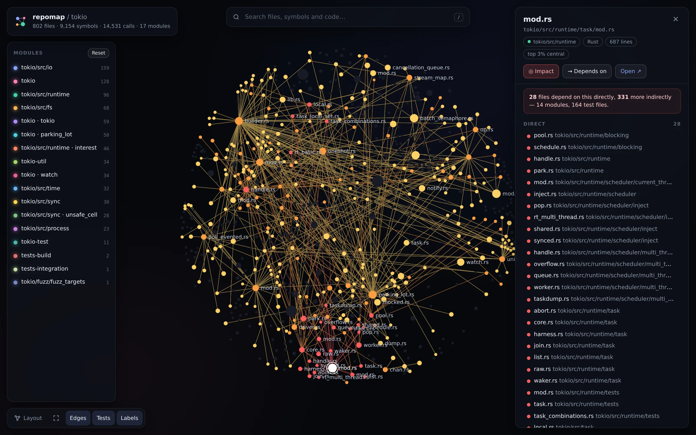
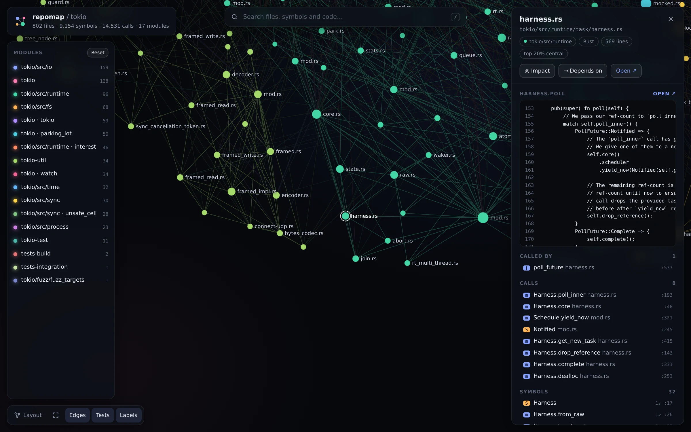
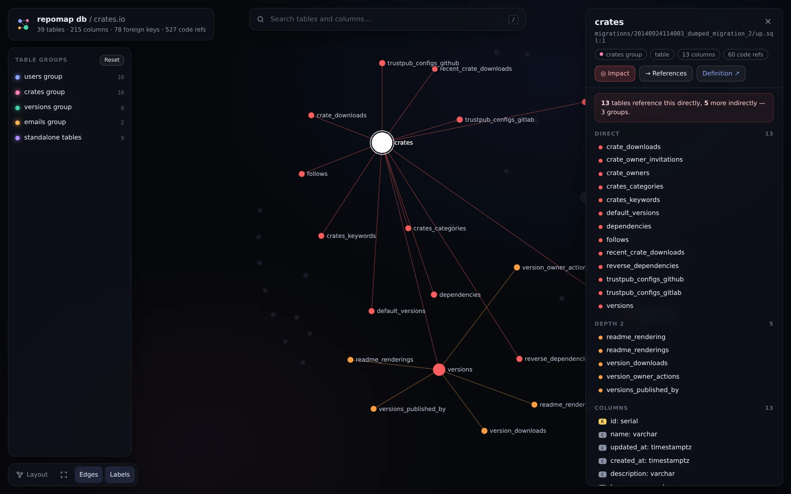

<div align="center">

# repomap

<!-- oneliner -->**A map of your codebase for AI agents: code graph, search, call paths and change impact. No API key.**<!-- /oneliner -->

Code graph · hybrid search · call paths · change impact · an interactive graph UI.<br>
One Rust binary. Local. No API key. MIT.

[](https://www.npmjs.com/package/@sylphx/repomap)
[](https://github.com/SylphxAI/repomap/actions/workflows/ci.yml)
[](https://registry.modelcontextprotocol.io/)
[](LICENSE)
<!-- repomap:agent-ready -->[](https://github.com/SylphxAI/repomap#agent-readiness-score)<!-- /repomap:agent-ready -->

[**Live demo**](https://sylphxai.github.io/repomap/demo) · [Docs](https://sylphxai.github.io/repomap/) · [Quickstart](#quickstart) · [Tools](#what-your-agent-gets) · [Graph UI](#the-graph-ui) · [Benchmarks](https://sylphxai.github.io/repomap/benchmarks) · [Compare](#how-it-compares)


<sub>The real UI on excalidraw (687 files, indexed in under half a second): search, a symbol's code and callers, then the blast radius of a change. <a href="https://sylphxai.github.io/repomap/demo">Try it in your browser</a>, no install needed.</sub>

</div>

## Quickstart

```bash
npx -y @sylphx/repomap setup     # add repomap to Claude Code, Codex, Cursor, VS Code, Claude Desktop, Windsurf, Gemini CLI
npx -y @sylphx/repomap serve     # open the graph UI for the current repo
```

That's it. Add `--claude-hooks` to also [enrich Claude Code's Grep and Glob](#claude-code-hook). `setup` detects the clients you have, writes their MCP config, and prints every change it made. Run it again and nothing changes. Then ask your agent: *"Use repomap to map this repo."*

<details>
<summary>Manual MCP config</summary>

```json
{
  "mcpServers": {
    "repomap": { "command": "npx", "args": ["-y", "@sylphx/repomap", "mcp"] }
  }
}
```

Claude Code: `claude mcp add repomap -- npx -y @sylphx/repomap mcp`
Claude Code plugin: `/plugin marketplace add SylphxAI/repomap`, then `/plugin install repomap@repomap`
Codex (`~/.codex/config.toml`):

```toml
[mcp_servers.repomap]
command = "npx"
args = ["-y", "@sylphx/repomap", "mcp"]
```

Docker (stdio, amd64/arm64):

```json
{ "mcpServers": { "repomap": { "command": "docker", "args": ["run", "-i", "--rm", "-v", "/path/to/repo:/workspace:ro", "ghcr.io/sylphxai/repomap"] } } }
```

The server indexes the client's workspace root (or its working directory, or `REPOMAP_ROOT`). Every tool also takes `root`.
</details>

## Why

Agents burn most of their context on `grep`, `ls` and reading whole files just to work out where things are. repomap gives them the map up front:

- **Where is it?** Hybrid search that matches symbol names *and* the words inside functions, with the lines that matched.
- **What is this?** One call returns a symbol's code, callers with call-site lines, callees, subtypes and the tests that reach it.
- **How does A reach B?** The shortest call path, each hop cited `file:line`.
- **What breaks if I change this?** Direct and indirect callers, importing files, modules touched, tests to run, and a risk level. Point it at your `git diff` before you commit.
- **What does this repo look like?** Modules found from real dependencies (not just folders), the most central files, the most used symbols, and entry points.

All of it comes from a local index: tree-sitter parsing, a resolved import and call graph, PageRank, Louvain communities and BM25 over AST chunks. Nothing leaves your machine, and no model or embedding API is called.

## What your agent gets

<!-- tools:start (generated by `repomap tools`; CI checks it) -->
Six tools, each with an obvious job:

| Tool | Ask it | Returns |
|---|---|---|
| `map` | "Give me the lay of the land" / `focus: "src/server"` | Modules, central files, key symbols, entry points; an outline with line numbers when focused |
| `search` | `"refresh token expiry"`, `"parseConfig"` | Ranked `file:line` ranges (functions, methods, classes) with the matching lines |
| `context` | `SessionStore.refresh`, `src/auth/token.ts`, `token.ts:42` | Code, callers (with call sites), callees, subtypes, members, imports, importers, tests |
| `trace` | `from: handleRequest, to: db.query` | Shortest call path, or the call tree above/below a symbol |
| `impact` | `target: verifyToken` or `changed: true` | Risk level, callers by depth, importing files, modules, tests to run |
| `db` | `table: users`, or `url_env: DATABASE_URL` for a live database | Tables, keys, indexes, and the code (`file:line`) that queries each table |
<!-- tools:end -->

Answers are compact text that cites `file:line`, so they cost few tokens. Pass `format: "json"` for structured output.

```text
> impact target=decode

# Impact (LOW risk)
Changing: function decode (src/auth/token.ts:14)
1 direct caller, 3 symbols affected in total across 3 files and 2 modules; 1 file importing the changed files; no tests reach this.

## Direct callers (will break if the contract changes)
- function verifyToken — src/auth/token.ts:8

## Indirect (depth 2)
- method SessionStore.refresh — src/auth/session.ts:5

## Indirect (depth 3)
- function handleRefresh — src/api/router.ts:6

## Importing files
- src/auth/session.ts
```

The same commands work in your terminal: `repomap map`, `repomap search "…"`, `repomap context X`, `repomap trace A B`, `repomap impact --changed`, `repomap db`.

## The graph UI

```bash
npx -y @sylphx/repomap serve            # live, with code preview
npx -y @sylphx/repomap export           # repomap.html: one self-contained file you can publish
```

<table>
<tr>
<td width="50%"></td>
<td width="50%"></td>
</tr>
<tr>
<td><b>Impact.</b> Select a file and press <kbd>i</kbd>: everything that depends on it lights up by depth, with a list you can click through.</td>
<td><b>Code.</b> Click a symbol to see its source, callers and callees. <b>Open ↗</b> jumps to your editor or to GitHub.</td>
</tr>
</table>

- WebGL rendering (Sigma.js) that stays smooth with tens of thousands of files and edges
- Modules coloured and clustered by their real dependencies, file size by PageRank; tests, examples and docs are muted and one click away
- <kbd>/</kbd> searches files, symbols and code; <kbd>d</kbd> shows dependencies; <kbd>f</kbd> fits the view
- Click a module to focus it, <kbd>Shift</kbd>-click to hide it; toggle tests, edges and labels
- `export` writes one HTML file with deep links (`#path/to/file`) and GitHub links pinned to your commit. It's a good fit for a README, a wiki or a design review.

## Database map

```bash
npx -y @sylphx/repomap db                              # from migrations / Prisma / Drizzle / SQLAlchemy / Diesel
npx -y @sylphx/repomap db --url-env DATABASE_URL       # live Postgres, MySQL or SQLite, read-only
npx -y @sylphx/repomap db users                        # one table: columns, indexes, who references it, where it is queried
npx -y @sylphx/repomap db --serve                      # the same graph UI, for tables and foreign keys
```

repomap reads your schema from the repository: SQL migrations (applied in order, with `down` migrations skipped), `schema.prisma`, Drizzle `pgTable`/`mysqlTable`/`sqliteTable`, SQLAlchemy and Flask-SQLAlchemy models, and Diesel `table!`. It can also introspect a live database. Each table is linked to the code that queries it: raw SQL (`FROM users`), Prisma (`prisma.user.findMany`), Diesel (`users::table`), and ORM models or tables used by files that import them.



Live connections are strictly read-only:
- **Postgres** runs in a `READ ONLY` transaction that the server must confirm.
- **MySQL** runs in a `START TRANSACTION READ ONLY` transaction.
- **SQLite** is opened read-only with `query_only`.

Only catalog metadata is read, never table rows. The connection string comes from an argument or an environment variable, and it is never stored or printed. Agents get the same data through the `db` MCP tool; pass `url_env` rather than the URL itself.

## Agent-readiness score

```bash
npx -y @sylphx/repomap score
```

The score rates how well an AI agent can work in the repository, from 0 to 100. It covers eight checks:
- agent instructions (AGENTS.md / CLAUDE.md and how useful they are)
- discoverable build and test commands
- test coverage
- CI
- module boundaries
- file sizes
- docs
- types

Each check that falls short comes with a concrete fix, and the score ends with a badge line for your README. For CI, use `--min 70`; `--update-readme README.md` refreshes the badge.

Keep the badge fresh with the GitHub Action:

```yaml
# .github/workflows/agent-ready.yml
on: { push: { branches: [main] } }
permissions: { contents: write }
jobs:
  score:
    runs-on: ubuntu-latest
    steps:
      - uses: actions/checkout@v4
      - uses: SylphxAI/repomap@v1
        with:
          update-readme: true   # replaces the agent-ready badge (or inserts one under the title)
          min-score: 0          # set e.g. 70 to fail below a bar
```

## Claude Code hook

```bash
npx -y @sylphx/repomap setup --claude-hooks
```

This is opt-in and safe to run again; `setup --remove` takes it out. It installs a PreToolUse hook: whenever Claude Code runs `Grep` or `Glob`, repomap adds where the symbol is defined, who calls it and which module it belongs to. It answers in tens of milliseconds and never blocks the search.

```text
repomap (code map) for this search:
- function `compose` defined at src/compose.ts:15 (module router); 3 callers: Hono.route (src/hono-base.ts:228), Hono.#dispatch (src/hono-base.ts:452), every (src/middleware/combine/index.ts:102)
```

## Languages

Parsed with tree-sitter for symbols, calls, imports and inheritance: **TypeScript, TSX, JavaScript, Python, Go, Rust, Java, Kotlin, Swift, C, C++, C#, Ruby, PHP.**
Search also covers Markdown, YAML, TOML, JSON, SQL, shell, Protobuf, GraphQL, HTML/CSS, Vue, Svelte, Scala and more.

Modules are found among your core code only. Tests, examples, docs and benchmarks are grouped separately, so they never name or blur a module.

Import resolution understands relative paths, `@/` aliases, npm workspace packages, Python packages and relative imports, Go modules, Rust `mod`/`use`/workspace crates, Java/PHP namespaces, C/C++ includes and Ruby `require`. `.gitignore` is respected, and so is `.repomapignore`.

## Fast

The index is built in parallel and cached per file, so after the first run only changed files are parsed again. The MCP server keeps the graph in memory and refreshes it when files change.

Measured on a 4 vCPU GitHub-hosted runner ([method and full table](https://sylphxai.github.io/repomap/benchmarks)):

| Repository | Code files | Cold index | Warm index | search p50 | impact p50 |
|---|---:|---:|---:|---:|---:|
| kubernetes | 11,710 | 11.2 s | 1.9 s | 57 ms | 5 ms |
| vscode | 6,125 | 8.0 s | 1.3 s | 7 ms | 6 ms |
| django | 2,271 | 2.2 s | 0.4 s | 21 ms | 1 ms |
| rust-analyzer | 1,512 | 1.8 s | 0.3 s | 4 ms | 2 ms |

## How it compares

| | **repomap** | GitNexus | Serena | claude-context | Aider repo map |
|---|---|---|---|---|---|
| Licence | **MIT** | PolyForm Noncommercial | MIT | MIT | Apache-2.0 (inside Aider) |
| Setup | `npx … setup`, one binary | `npx`, Node | Python + language servers | Vector DB + embedding API key | Part of Aider |
| API key / network | **None** | None for the graph | None | Required (embeddings) | None |
| Code graph (calls, imports, inheritance) | ✅ | ✅ | Via LSP references | — | Ranking only |
| Change impact / blast radius | ✅ incl. `git diff` | ✅ | — | — | — |
| Call path between two symbols | ✅ | ✅ | — | — | — |
| Keyword + symbol search | ✅ BM25 + names | ✅ | ✅ symbols | Semantic (vectors) | — |
| Interactive graph UI | ✅ local + static export | ✅ | — | — | — |
| Claude Code Grep/Glob hook | ✅ opt-in | ✅ | — | — | — |
| Database schema map linked to code | ✅ live (read-only) + migrations/ORMs | — | — | — | — |
| Agent-readiness score + badge | ✅ + GitHub Action | — | — | — | — |
| Module detection | ✅ Louvain | ✅ | — | — | — |
| Edits code | — (read-only) | — | ✅ | — | ✅ |
| Engine | Rust | TypeScript | Python | TypeScript | Python |

Pick Serena if you want LSP-precise refactoring edits, and claude-context if you want embedding-based semantic search. repomap is for understanding and navigating a codebase with zero setup, and a licence you can use at work.

## CLI

```text
repomap setup [--client cursor,codex] [--claude-hooks] [--dry-run] [--remove]
repomap serve [dir] [--port 7878] [--no-open]
repomap export [dir] [--out repomap.html] [--json]
repomap map [dir-to-focus] [-C root] [--json]
repomap search <query> [--path src/] [--kind function] [--limit 10]
repomap context <target> [--code-lines 60]
repomap trace <from> [to] [--callers] [--depth 3]
repomap impact [targets…] [--changed] [--base main]
repomap db [table] [--url-env VAR | --url URL] [--serve | --out db.html] [--json]
repomap score [dir] [--json] [--min N] [--update-readme README.md [--insert]]
repomap index [dir] [--no-cache] [--json]
repomap mcp [--root dir]
```

Binaries for macOS (arm64, x64), Linux glibc (x64, arm64) and Windows x64 ship as npm optional dependencies. They're also attached to each [GitHub release](https://github.com/SylphxAI/repomap/releases). From source: `cargo install --git https://github.com/SylphxAI/repomap repomap`.

## Migrating from Spine, Locus or CodeRAG

`@sylphx/spine`, `@sylphx/locus` and `@sylphx/coderag` are thin aliases of `@sylphx/repomap`, and their old tool names still work until 2.0. See the [migration guide](https://sylphxai.github.io/repomap/guide/migrate) for the name mapping and how to switch.

## Contributing

```bash
cargo test --workspace          # engine + CLI tests
bun install && bun run build:ui # rebuild the UI bundle (ui/ -> crates/repomap/assets/)
cargo run -p repomap -- serve .
```

Issues and PRs are welcome, and new language support is especially useful: add a grammar and a query in `crates/repomap-core/src/lang.rs`.

## Also from Sylphx

[**anymd**](https://github.com/SylphxAI/anymd) turns any file into clean Markdown for your AI agent: PDF, Word, PowerPoint, Excel, EPUB, HTML, images, and audio/video. Like repomap, it runs locally, needs no API key, and is MIT licensed.

## Also from Sylphx

- [**anymd**](https://github.com/SylphxAI/anymd): any file (PDF, Word, PowerPoint, Excel, EPUB, HTML, images) to clean Markdown for AI agents. Rust MCP server + CLI, local.
- [**lockdocs**](https://github.com/SylphxAI/lockdocs): exact-version library docs from your lockfile. Local, offline, no rate limits.
- [**readme-mark**](https://github.com/SylphxAI/readme-mark): beautiful README images from one URL: banners, shields-compatible badges, icons, stats cards. It serves repomap's agent-ready badge.

## Star history

[](https://star-history.com/#SylphxAI/repomap&Date)

MIT © Sylphx
